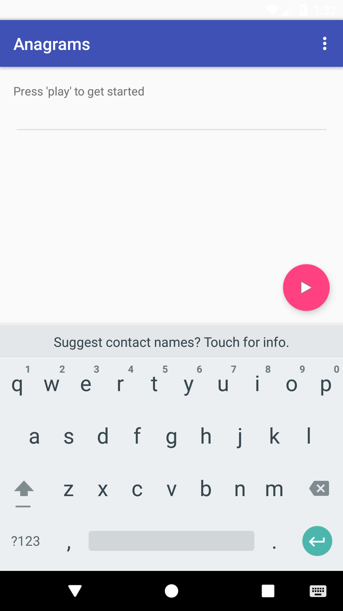
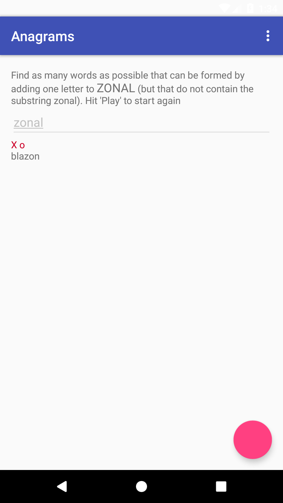
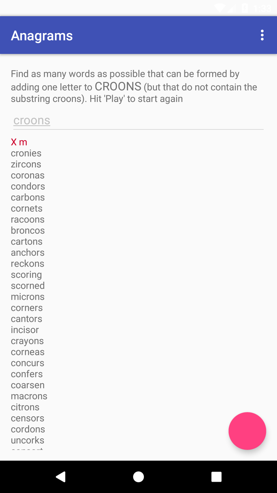

# Anagram Android App

A word puzzle game where players find anagrams by adding one letter to a given base word. Built as part of Google's Applied CS with Android curriculum.

## How It Works

1. Press **Play** to receive a starter word
2. Think of valid English words formed by adding one letter to the base word and rearranging
3. Type your guesses — correct answers appear in green, wrong ones in red
4. When stuck, press the **?** button to reveal remaining answers

The dictionary is loaded from a bundled `words.txt` asset file. Anagram lookups use a sorted-letter key HashMap for O(1) retrieval instead of brute-force iteration.

## Screenshots

| Start | Playing | Results |
|:---:|:---:|:---:|
|  |  |  |

## 🛠 Tech Stack

| | Technology | Purpose |
|---|---|---|
| 📱 | Android SDK 34 | Target platform |
| ☕ | Java 8 | Language |
| 🎨 | Material Design | UI components (FAB, AppBar, CoordinatorLayout) |
| 🧪 | JUnit 4 + Espresso | Testing |
| 🔧 | Gradle 7.5 | Build system |

## Setup

```bash
git clone https://github.com/stabgan/Anagram-Android-App.git
```

Open in Android Studio (Hedgehog or later), sync Gradle, and run on an emulator or device (API 23+).

## Project Structure

```
app/src/main/
├── assets/words.txt                  # Dictionary file
├── java/.../anagrams/
│   ├── AnagramDictionary.java        # Core game logic & word lookup
│   └── AnagramsActivity.java         # UI controller
└── res/
    ├── layout/                       # Activity & content layouts
    ├── values/                       # Colors, strings, dimensions, styles
    └── menu/                         # Action bar menu
```

## ⚠️ Known Issues

- The `words.txt` dictionary is English-only
- No difficulty settings beyond the automatic word-length progression (3→7 letters)

## License

Apache 2.0 — see [LICENSE](LICENSE) for details.
